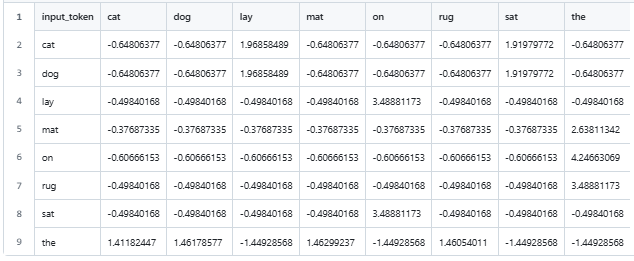

# toy-gpt-chat

[](https://github.com/toy-gpt/toy-gpt-chat/actions/workflows/deploy-vue-vite.yml)
[](https://opensource.org/license/MIT)
[](https://github.com/toy-gpt/toy-gpt-chat/actions/workflows/ci-hygiene.yml)
[](https://github.com/toy-gpt/toy-gpt-chat/actions/workflows/links.yml)
[](https://github.com/toy-gpt/toy-gpt-chat/security)

> Interactive visualization of next-token prediction (using word-level tokens) in GPT-style language models.

Minimal chat interface demonstrating inference only - no learning happens here.

Loads pretrained artifacts from `toy-gpt-train` repositories and runs forward passes to generate **next-token predictions**.

## Key Idea

Large language models (LLMs) are about language, but typically not about semantics or what words mean.

LLMs work on **structure**, that is, how words (tokens) appear in relationship to each other.

LLMs build a geometry based on **statistical proximity**.

## Quick Start

```shell
git clone https://github.com/toy-gpt/toy-gpt-chat.git
cd toy-gpt-chat
npm install
npm run dev
```

Enter a prompt, and see the best guesses (with probabilities) as different models try to predict the next word.

## What Happens As You Type

As you type, you are asking the models to predict the next word.
With each update:

1. The prompt is converted to vectors.
2. The model computes next-token probabilities.
3. A token is selected (among those with the highest probability).
4. The process repeats.

## Process

When you type a prompt, the system performs **inference only**.
No learning or parameter updates occur.

Each step is intentionally simple and inspectable.

### Step 1. Load vocabulary and weight matrices
For each model card, the app loads pre-trained artifacts from GitHub training repos:

- a **vocabulary file** mapping words → integer IDs
- a **weight matrix** learned during training

These artifacts are stored as CSV files so they can be viewed directly.


### Step 2. Convert prompt tokens to IDs
The prompt text is split into word tokens using whitespace.

Each token is looked up in the vocabulary:
- known words are converted to IDs
- unknown words are ignored

Only tokens present in the training data influence predictions.


### Step 3. Select an input state (context window)
Each model uses a fixed number of **previous words** to define its input:

- unigram: 1 previous word
- bigram: 2 previous words
- context-3: 3 previous words

This context determines which **row of the weight matrix** is used.

### Step 4. Forward pass: logits → softmax → probabilities
The selected weight row contains raw scores (logits) for every possible next word.
A logit is a raw score often interpreted as log-odds (the log of the odds).
A higher value means more likely, and lower means less likely, but it is not yet a probability.

These scores are passed through **softmax**, a process used to produce probabilities that:
- are all positive
- sum to 1 (100%)

This yields a full probability distribution over the vocabulary.

### Step 5. Token selection (greedy or top-K)
From the probability distribution:

- the most likely next word is identified (greedy choice)
- the top-K probabilities are displayed for inspection

No randomness is used unless explicitly added later.


### Step 6. Autoregressive generation loop (conceptual)
In a full language model, the chosen word would be appended to the prompt and the process repeated to generate longer text.
An autoregressive model uses **its own previous output** as part of the next input.

In this demo, generation usually stops after **one step** so results remain easy to inspect and compare across models.


## Two-Part Architecture

- **Training** (completed earlier): Updates model parameters via gradient descent (minimizing error).
- **Inference** (shown here): Computes `softmax(weights @ input)` -> sample -> repeat.


## Insights

The initial training text is intentionally neutral.

- Neutral corpus (cat_dog): Increasing context (number of words before the predicted word) doesn't help.
- There is just no useful structure in the training text to exploit.

Later training sets will be more structured.

- Structured corpus (animals): Increasing context will help, and there are patterns that emerge that the models can exploit to improve predictions.

With structured training text, we can start to see how probability distributions
begin to indicate clear favorites for the "predicted next word".

## What GPT Means

GPT stands for:

- **Generative**: it generates text
- **Pre-trained**: trained before being used
- **Transformer**: the neural network architecture used in modern systems

The chat interface is not GPT.
GPT refers to the model architecture used in modern systems.

ChatGPT got its name from using a **Generative Pre-trained Transformer (GPT)**.

During usage, we **run the GPT forward to generate predictions**.

- "train" explains how the landscape is formed
- "chat" explains how we move through it

**Training**
- happens offline
- changes model parameters
- requires large datasets and compute
- is done infrequently
- builds a complex, multidimensional "landscape"

**Chat (usage/inference)**
- happens when a question is asked
- does NOT change parameters
- reuses existing infrastructure
- is fast and repeatable

## This Demo is Not a GPT

This repository demonstrates usage only.

- It is NOT a transformer (no attention, no embeddings beyond the weight matrix).
- There is NO semantic understanding, beyond the structural/statistical meaning that arises from proximity.
- There is no training taking place - all training data is read from pre-trained projects.

## Training Data for each Model Card

Training data is stored in different repositories in the [Toy-GPT Project](https://github.com/toy-gpt).

For example, given this [simple training data](https://github.com/toy-gpt/train-100-unigram/blob/main/corpus/000_cat_dog.txt):

```text
the cat sat on the mat
the dog sat on the rug
the cat lay on the rug
the dog lay on the mat
```

A simple "unigram" model (it only looks at one word to predict the next), created the following artifacts:

| File                                                                                                                      | Purpose                      |
| ------------------------------------------------------------------------------------------------------------------------- | ---------------------------- |
| [`artifacts/01_vocabulary.csv`](https://github.com/toy-gpt/train-100-unigram/blob/main/artifacts/01_vocabulary.csv)       | ID, token, frequency (count) |
| [`artifacts/02_model_weights.csv`](https://github.com/toy-gpt/train-100-unigram/blob/main/artifacts/02_model_weights.csv) | Learned weight matrix        |

The first shows the vocabulary and the frequency of each word in the corpus (training set).

| token_id | token | frequency |
| -------- | ----- | --------- |
| 0        | cat   | 2         |
| 1        | dog   | 2         |
| 2        | lay   | 2         |
| 3        | mat   | 2         |
| 4        | on    | 4         |
| 5        | rug   | 2         |
| 6        | sat   | 2         |
| 7        | the   | 8         |

The second shows the model weights after iteratively training to get the least possible error (using gradient descent).




## How To Use

Look at the training text.

Enter a prompt based on the training text.

As you type, the cards will show the "best guess" for the next word based on different methods of training.

Each model:
- computes probabilities for the next word
- selects a "most likely" completion
- does not learn from the interaction

## Note

- The model does not understand language.
- It does not claim correctness or truth.

This demo illustrates the foundations of generative LLM models.

## License

[MIT](./LICENSE)

## SE Manifest

[SE_MANIFEST.toml](./SE_MANIFEST.toml) - project intent, scope, and role
